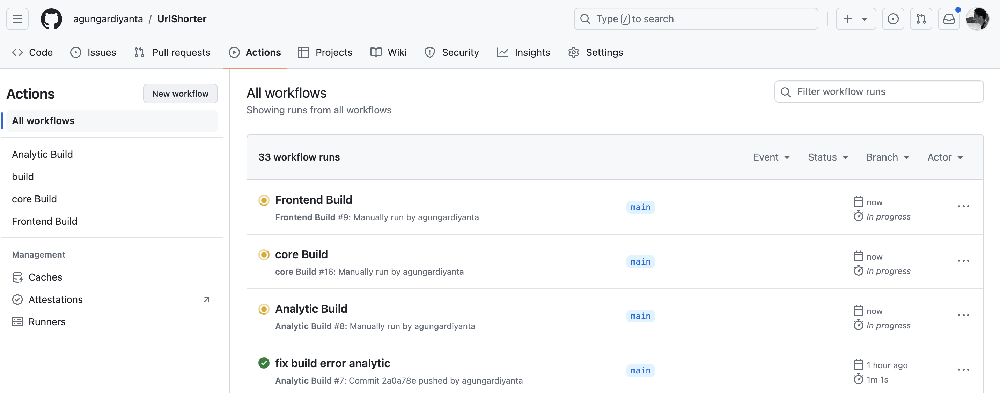
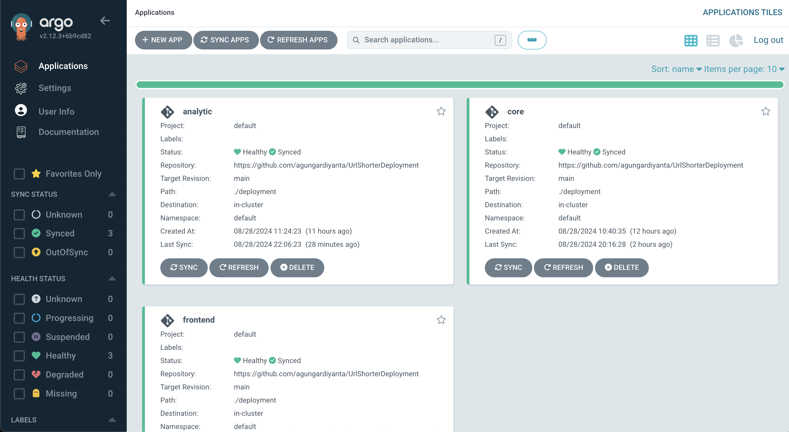
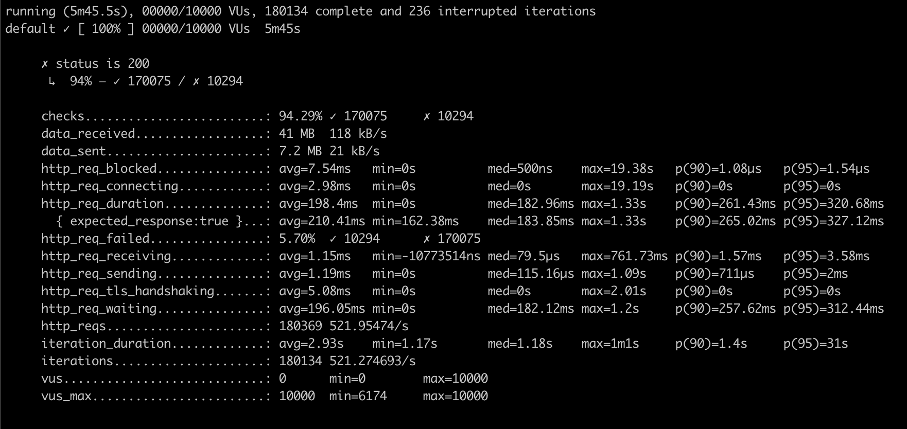

# UrlShorterDeployment
Repository ini bagian dari repositoy [UrlShorter](https://github.com/agungardiyanta/UrlShorter) yang menyimpan infrastructure code atau script yang digunakan project dapat diakses di [https://dsandbox.online](https://dsandbox.online).

UrlShorter project merupakan aplikasi yang menyediakan layanan untuk mengubah atau memperpendek link menjadi `short_id` yang unik.\
Project ini dibagi menjadi 3 service utama frontend, core dan analytic
* frontend service sebagai tampilan web menggunakan vite.js + react
Lalu ada dua backend service menggunakan bahasa Golang 1.22
* core service merupakan API backend yang membuat dan melakukan redirect link dengan short_id 
* analytic service merupakan API backend yang menyimpan berapa banyak total sebuah link short_id diakses

## Infrastructure
*  Cluster\
 Project ini di deploy dalam cluster Google Kubernetes Engine dengan konfigurasi 1 nodepool dengan konfigurasi 2 x node tipe e2-highcpu-4 (2 x 2 Core CPU dan 4GB RAM) menggunakan terraform
* Database\
Menggunakan Postgresql version 16 dideploy melalui helm chart standart [bitnami](https://github.com/bitnami/charts/tree/main/bitnami/postgresql/#installing-the-chart) konfigurasi `1 instances`
* Cache\
Menggunakan Redis version 7 dideploy melalui helm chart standart [bitnami](https://github.com/bitnami/charts/tree/main/bitnami/redis)
konfigurasi `1 master 3 replicas slave`

* Ingress
Menggunakan ingress controller kubernetes nginx version v1.11.2 ( chart 4.11.2) konfigurasi `7 replica controller`

## CI/CD
CI/CD menggunkan `Github actions` dan `Argocd`
Flow build image dijalankan di github actions ketika ada changes di masing masing folder service backend dan frontend. 
Konfigurasi github actions dapat dilihat [disini](https://github.com/agungardiyanta/UrlShorter/tree/main/.github/workflows).
Github Actions

ArgoCD dedeploy dalam cluster yang sama dan digunakan untuk melakukan sinkronisasi deployment
ArgoCD

## Load Testing / Spike Testing
Pengujian project ini menggunakan K6s open source project grafana dengan simulasi traffic. Sebelum pengujian deployment service dikonfigurasi 3 replica dan menggunakan Horizontal Pod Autoscaler yang dapat dilihat [disini](https://github.com/agungardiyanta/UrlShorterDeployment/tree/main/HPA), dari pengujian access API didapatkan hasil 

Hasil dari K6s menunjukkan API dapat menghandle `521.274693/s` (RPS), namun banyak request yang gagal saat simulasi spike, presentase request yang berhasil sebesar `94.29%` dari total  `180369` request.
Skema pengujian dapat dilihat pada script berikut [k6s script](https://github.com/agungardiyanta/UrlShorterDeployment/blob/main/k6s/get-script.js)

## Monitoring Plan (TODO)

Untuk monitoring service dapat menggunakan prometheus untuk metrics seperti resources usage dan Loki sebagai Logs scraper. Hasil dari metrics dan Logs dapat di tampilkan di dashboard grafana.
Untuk melakukan tracing sebaiknya juga menggunakan Jaeger yang dikombinasikan dengan OpenTelemetry, nantinya dapat diketahui lamanya process tiap API berjalan.

